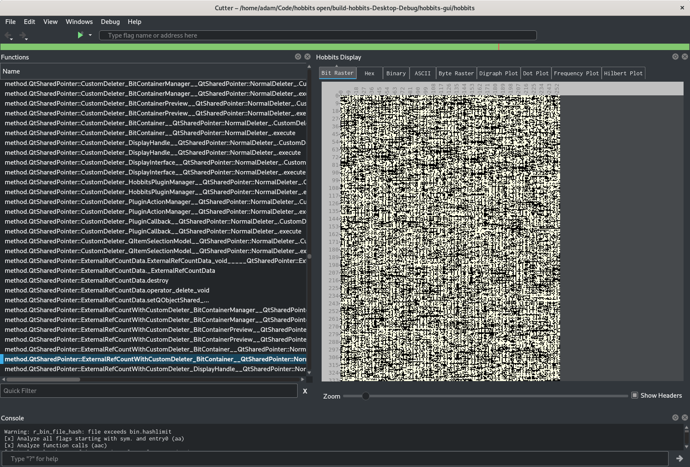
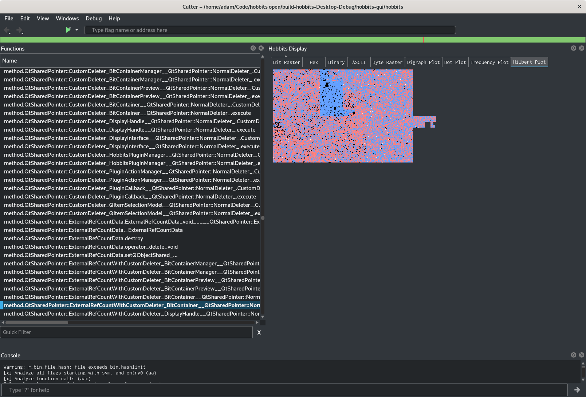

This is a work-in-progress, but the current code builds and runs as long as
[src/HobbitsCutterPlugin.pro](src/HobbitsCutterPlugin.pro) is configured
correctly. Here are some examples of it running:

